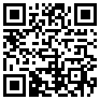

## What You Will Find in This Document

This document will provide information about the "RxSDK Symbol" component:

### RxSymbols

- **Description**: With this object, you can load symbols from Rasterex symbol libraries located either in the local file system or from a `RxViewServer` installation. The object can also generate barcode images using several different standards.
- **Usage**: `RxSymbol` is usually used together with `RxRedlines` but may also be used as a standalone component.

### Barcodes

`RxSymbols` can generate barcodes for your application, and you may add these as markup by using `RxRedlines` or export them as image files. The following barcode standards are supported:

| Barcode Standard | Method for Generation   |
| ---------------- | ----------------------- |
| Aztec 2D         | `GetAztecBarcodeDIB`    |
| Code 128         | `Get128BarcodeDIB`      |
| Code 39          | `Get39BarcodeDIB`       |
| Code 93          | `Get93BarcodeDIB`       |
| DataMatrix 2D    | `GenerateDataMatrixDIB` |
| QR               | `GenerateQR`            |
| QR               | `GenerateQRMeta`        |

### Additional Information

- **Provider**: Rasterex Software a.s
- **Website**: [http://www.rasterex.com](http://www.rasterex.com)

### QR Code Example

- **Description**: QR code created with the `GenerateQR` method.

  
