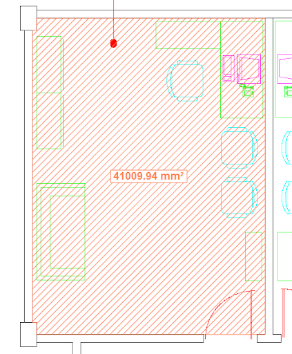
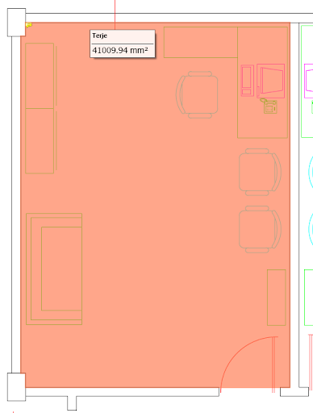

In this section, you will find additional information about RxSDK objects and their usage.

## Appendix A: Visual Appearance of Annotations

The `ExportPDFMarkupEx` function will attempt to convert existing `RxRedline` markup elements to corresponding Acrobat PDF annotations/comments. Since Acrobat PDF annotations follow the PDF documentation from Adobe, some of the markups created by `RxRedline` will look different when converted to a PDF annotation. `RxRedline` supports more element types and styles than PDF annotations do.

If the visual appearance is more important than having markup elements as PDF annotations, you should use the `PDFMarkupBurnin` method instead of `ExportPDFMarkupEx`.

### Observed Differences with `ExportPDFMarkupEx`

- **Hatching**: Not supported by PDF annotations. Instead, the markup element will be solid-filled and transparent.
- **Text Size**: Acrobat limits free text annotations to 12 units (1 unit = 1/72 inch).
- **Transparency**: `RxRedline` uses a merge operand to visualize transparent markup elements, while PDF uses a transparency factor between 0 and 1.0. Due to this, transparent markup elements may appear differently.
- **Measurement Area Elements**: These do not have a PDF equivalent and are converted to a PDF polygon, with the measurement text attached as a note to the PDF annotation.

#### Comparison

| RxRedline Measurement Area         | PDF Annotation Appearance    |
| ---------------------------------- | ---------------------------- |
|        |  |
| Original appearance in `RxRedline` | Converted appearance in PDF  |

## Appendix B: Merging PDF Files

`RxPDF` makes it very easy to merge multiple PDF files, even with different page sizes, into a single multi-page PDF file.

### Steps to Merge Files

1. Start the merge process by using the `PDFMergeStart()` method:

   ```cpp
   PDFMergeStart();
   ```

2. Add files to the new merged document. To add all pages from a PDF file, use:

   ```cpp
   PDFMergeAdd("c:\\mergein\\file1.pdf");  // Includes all pages from file1.pdf
   ```

3. To add only certain pages from a file, use `PDFMergeAddEx`. Examples:

   ```cpp
   PDFMergeAddEx("c:\\mergein\\file2.pdf", "1;2;3;");  // Includes pages 1, 2, and 3 from file2.pdf
   PDFMergeAddEx("c:\\mergein\\file3.pdf", "1;20;");   // Includes pages 1 and 20 from file3.pdf
   ```

4. Once all files and pages are added, close the merge and output the new file:
   ```cpp
   PDFMergeClose("c:\\mergeout\\output.pdf");
   ```
   All files and pages will be written to the new file, in this case, named `output.pdf`.

#### Notes

- Any filename sent to `RxPDF` using the above methods must include the full path, including the folders.

## Appendix C: Return Values

The COM objects expose one or more interfaces each. All methods defined by these interfaces return an `HRESULT` status value to inform the client about the success or failure of the requested operation.

Currently, the RxSDK objects return the following standard `HRESULT` values:

| Name           | Description                                  | Value      |
| -------------- | -------------------------------------------- | ---------- |
| S_OK           | Operation successful                         | 0x00000000 |
| S_FALSE        | Operation successful, but may have been void | 0x00000001 |
| E_UNEXPECTED   | Unexpected failure                           | 0x8000FFFF |
| E_NOTIMPL      | Not implemented                              | 0x80004001 |
| E_OUTOFMEMORY  | Failed to allocate necessary memory          | 0x8007000E |
| E_INVALIDARG   | One or more arguments are invalid            | 0x80070057 |
| E_NOINTERFACE  | No such interface supported                  | 0x80004002 |
| E_POINTER      | Invalid pointer                              | 0x80004003 |
| E_HANDLE       | Invalid handle                               | 0x80070006 |
| E_ABORT        | Operation aborted                            | 0x80004004 |
| E_FAIL         | Unspecified failure                          | 0x80004005 |
| E_ACCESSDENIED | General access denied error                  | 0x80070005 |

### Notes

- For the RxSDK components, only the `S_OK` value indicates a 100% successful operation. All other return values should be treated as an error condition.
