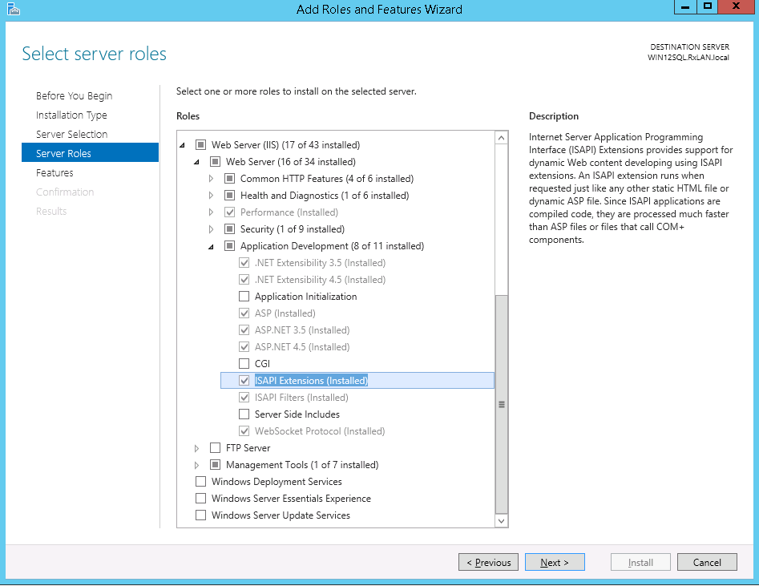
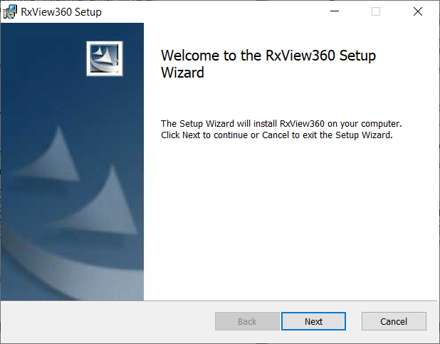
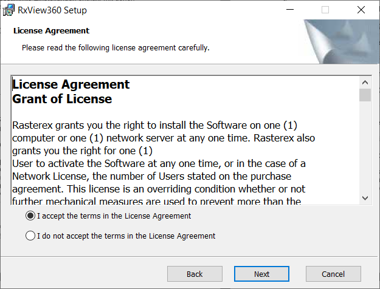
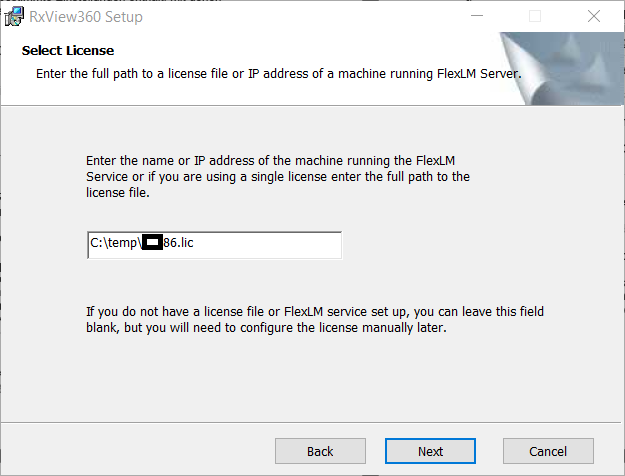
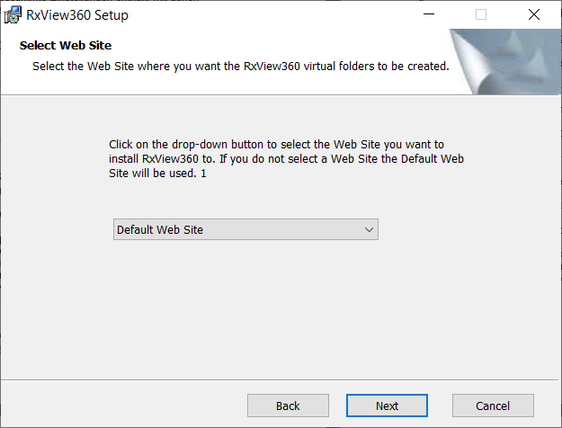
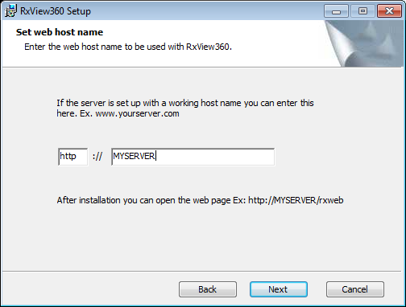
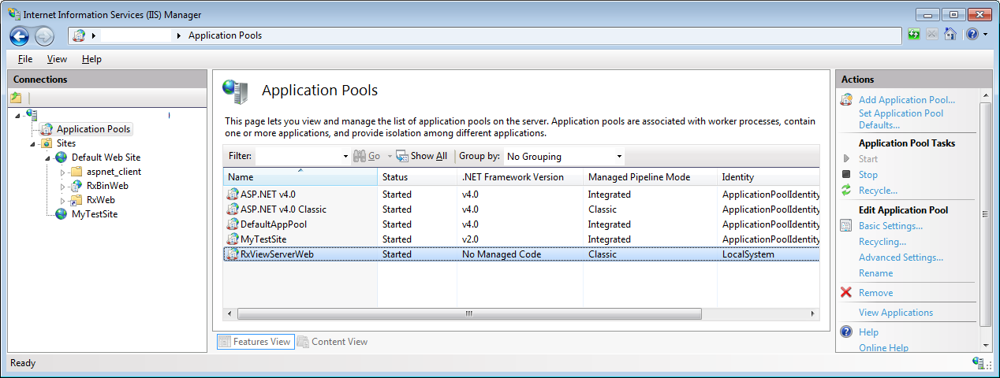
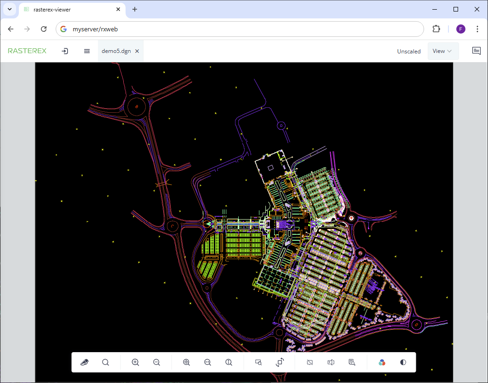

Set up the viewer and server.

## Requirements

A server running MS Windows with IIS 7 or newer.

Below is a list of the IIS configuration requirements.


Activate all necessary features and services.


## Installation

You should have received a license file with extension “lic”. Copy this file to a folder on the local machine like C:\Temp or another folder with no security restrictions.

Download the latest installation using the link below.

Run the RxView360 setup msi from a command prompt running “as Administrator”.

### Basic version

[MSI installation 64 bit](https://dl.rasterex.com/RxView360_PDFJS_64R12B6.msi)

``` console

C:\temp>msiexec /i RxView360_PDFJS_64R12B6.msi

```

### Pro version

[MSI installation 64 bit](https://dl.rasterex.com/RxView360_Foxit_64R12B5.msi)


``` console

C:\temp>msiexec /i RxView360_Foxit_64R12B5.msi

```

<center>


Select Next




Select “I accept…” and select Next


Select Next



Select Next after filling in full path to license file.



Select Web site and click next.



Proceed to complete the installation.

</center>

When installed you should see that an application pool, virtual folders and an application rxbinweb has been added to your server.





Open your browser and check that Rasterex Web Viewer is running correctly by opening one of the demonstration files.




